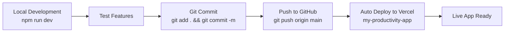

# 🚀 Productivity Hub Development Guide

## 📁 Project Structure
**Main Repository**: https://github.com/userlxrss/ultimate-assistant-web-app.git
**Local Directory**: `/Users/larstuesca/Documents/agent-girl/chat-ac5267c7`
**Vercel Project**: `my-productivity-app` ← **YOUR MAIN PROJECT**

## 🔄 Development Workflow

### Daily Development Process


### Commands You'll Use
```bash
# Start local development
npm run dev

# Commit and deploy changes
git add .
git commit -m "your feature description"
git push origin main

# Check deployment status
# Go to your Vercel dashboard → my-productivity-app
```

## 🎯 **Single Project Rule**
- ✅ **ONE local project**: `/Users/larstuesca/Documents/agent-girl/chat-ac5267c7`
- ✅ **ONE GitHub repo**: `ultimate-assistant-web-app`
- ✅ **ONE Vercel project**: `my-productivity-app`
- ❌ NO more side projects or duplicates

## 📦 Project Features (All in One Place)

### ✅ Already Implemented
- **Journal System**: Secure user journal storage with mood tracking
- **Task Management**: Tasks with timers, priorities, and categories
- **Email Integration**: Gmail connectivity and email client
- **Contacts Management**: Google Contacts integration
- **Calendar System**: Calendar views and event management
- **Authentication**: Multiple auth providers (Google, Firebase, Supabase)
- **Security**: User data isolation and encryption

### 🔧 Future Updates
All new features will be added to this same project:
- Enhanced journal analytics
- Better task automation
- Improved email features
- Mobile responsiveness
- Performance optimizations

## 🌐 Deployment

### Automatic Deployment
- **Push to `main` branch** → Deploys to production
- **Push to `dev` branch** → Creates preview deployment
- **Pull requests** → Automatic preview URLs

### Manual Deployment (if needed)
```bash
# Deploy current changes immediately
vercel --prod
```

## 📋 Best Practices

### 1. Git Workflow
- Always work on the `main` branch for simplicity
- Commit frequently with descriptive messages
- Push changes to trigger deployments

### 2. Local Development
- Use `npm run dev` for local testing
- Test features before committing
- Keep dependencies updated

### 3. Project Management
- ONE Vercel project: `my-productivity-app`
- Archive/delete unused projects
- Keep GitHub and Vercel connected

### 4. Feature Development
- Add features to existing components
- Maintain consistent styling
- Test with real user scenarios

## 🎉 This ensures:
- ✅ Single source of truth
- ✅ Consistent deployment pipeline
- ✅ Easy project management
- ✅ All features in one place
- ✅ No confusion about which project is which

---

**📝 Remember**: From now on, everything goes into `my-productivity-app`!