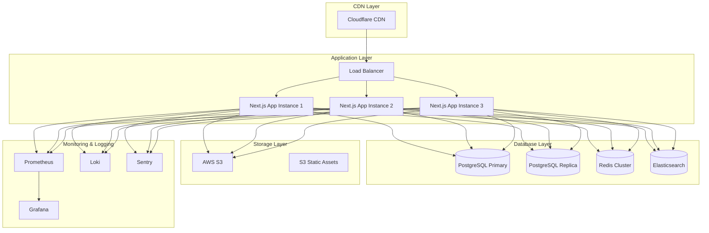

# Deployment and Monitoring Guide - Ultimate Assistant Hub

## Overview

This guide covers the complete deployment strategy, monitoring setup, and operational procedures for the Ultimate Assistant Hub in a production environment.

## Deployment Architecture

### 1. Production Infrastructure



### 2. Deployment Pipeline

```yaml
# .github/workflows/deploy.yml
name: Deploy to Production

on:
  push:
    branches: [main]
  pull_request:
    branches: [main]

env:
  NODE_VERSION: '20'
  REGISTRY: ghcr.io
  IMAGE_NAME: ${{ github.repository }}

jobs:
  test:
    runs-on: ubuntu-latest
    steps:
      - uses: actions/checkout@v4

      - name: Setup Node.js
        uses: actions/setup-node@v4
        with:
          node-version: ${{ env.NODE_VERSION }}
          cache: 'npm'

      - name: Install dependencies
        run: npm ci

      - name: Run tests
        run: npm run test

      - name: Run E2E tests
        run: npm run test:e2e

      - name: Run security audit
        run: npm audit --audit-level moderate

  build:
    needs: test
    runs-on: ubuntu-latest
    if: github.ref == 'refs/heads/main'
    outputs:
      image-digest: ${{ steps.build.outputs.digest }}
      image-tag: ${{ steps.meta.outputs.tags }}

    steps:
      - uses: actions/checkout@v4

      - name: Setup Node.js
        uses: actions/setup-node@v4
        with:
          node-version: ${{ env.NODE_VERSION }}
          cache: 'npm'

      - name: Install dependencies
        run: npm ci

      - name: Generate build info
        id: meta
        uses: docker/metadata-action@v5
        with:
          images: ${{ env.REGISTRY }}/${{ env.IMAGE_NAME }}
          tags: |
            type=ref,event=branch
            type=ref,event=pr
            type=sha,prefix={{branch}}-
            type=raw,value=latest,enable={{is_default_branch}}

      - name: Log in to Container Registry
        uses: docker/login-action@v3
        with:
          registry: ${{ env.REGISTRY }}
          username: ${{ github.actor }}
          password: ${{ secrets.GITHUB_TOKEN }}

      - name: Build and push Docker image
        id: build
        uses: docker/build-push-action@v5
        with:
          context: .
          push: true
          tags: ${{ steps.meta.outputs.tags }}
          labels: ${{ steps.meta.outputs.labels }}
          cache-from: type=gha
          cache-to: type=gha,mode=max
          build-args: |
            NEXT_PUBLIC_APP_VERSION=${{ github.sha }}
            BUILD_DATE=${{ github.event.head_commit.timestamp }}

  deploy:
    needs: build
    runs-on: ubuntu-latest
    if: github.ref == 'refs/heads/main'
    environment: production

    steps:
      - name: Deploy to Vercel
        uses: amondnet/vercel-action@v25
        with:
          vercel-token: ${{ secrets.VERCEL_TOKEN }}
          vercel-org-id: ${{ secrets.ORG_ID }}
          vercel-project-id: ${{ secrets.PROJECT_ID }}
          vercel-args: '--prod'
          working-directory: ./

      - name: Update deployment status
        run: |
          curl -X POST \
            -H "Authorization: Bearer ${{ secrets.GITHUB_TOKEN }}" \
            -H "Accept: application/vnd.github.v3+json" \
            https://api.github.com/repos/${{ github.repository }}/deployments \
            -d '{
              "ref": "${{ github.sha }}",
              "environment": "production",
              "description": "Deployed to production"
            }'

  security-scan:
    needs: build
    runs-on: ubuntu-latest
    if: github.ref == 'refs/heads/main'

    steps:
      - name: Run Trivy vulnerability scanner
        uses: aquasecurity/trivy-action@master
        with:
          image-ref: ${{ needs.build.outputs.image-tag }}
          format: 'sarif'
          output: 'trivy-results.sarif'

      - name: Upload Trivy scan results to GitHub Security tab
        uses: github/codeql-action/upload-sarif@v2
        with:
          sarif_file: 'trivy-results.sarif'

  performance-test:
    needs: deploy
    runs-on: ubuntu-latest
    if: github.ref == 'refs/heads/main'

    steps:
      - name: Wait for deployment
        run: sleep 60

      - name: Run Lighthouse CI
        uses: treosh/lighthouse-ci-action@v10
        with:
          urls: |
            https://your-domain.com
            https://your-domain.com/dashboard
            https://your-domain.com/journal
          configPath: './lighthouserc.json'
          uploadArtifacts: true
          temporaryPublicStorage: true
```

### 3. Docker Configuration

```dockerfile
# Dockerfile
# Multi-stage build for optimization
FROM node:20-alpine AS base
RUN apk add --no-cache libc6-compat
WORKDIR /app
COPY package*.json ./
RUN npm ci --only=production && npm cache clean --force

# Dependencies stage
FROM base AS deps
COPY package*.json ./
RUN npm ci

# Build stage
FROM base AS builder
COPY --from=deps /app/node_modules ./node_modules
COPY . .
ENV NEXT_TELEMETRY_DISABLED 1
RUN npm run build

# Runner stage
FROM base AS runner
WORKDIR /app

ENV NODE_ENV production
ENV NEXT_TELEMETRY_DISABLED 1

RUN addgroup --system --gid 1001 nodejs
RUN adduser --system --uid 1001 nextjs

COPY --from=builder /app/public ./public
COPY --from=builder --chown=nextjs:nodejs /app/.next/standalone ./
COPY --from=builder --chown=nextjs:nodejs /app/.next/static ./.next/static

USER nextjs

EXPOSE 3000

ENV PORT 3000
ENV HOSTNAME "0.0.0.0"

CMD ["node", "server.js"]

# Health check
HEALTHCHECK --interval=30s --timeout=3s --start-period=5s --retries=3 \
  CMD curl -f http://localhost:3000/api/health || exit 1
```

```yaml
# docker-compose.yml
version: '3.8'

services:
  app:
    build: .
    ports:
      - "3000:3000"
    environment:
      - NODE_ENV=production
      - DATABASE_URL=${DATABASE_URL}
      - REDIS_URL=${REDIS_URL}
      - JWT_SECRET=${JWT_SECRET}
      - ENCRYPTION_KEY=${ENCRYPTION_KEY}
    depends_on:
      - postgres
      - redis
    restart: unless-stopped
    healthcheck:
      test: ["CMD", "curl", "-f", "http://localhost:3000/api/health"]
      interval: 30s
      timeout: 10s
      retries: 3
    labels:
      - "prometheus.scrape=true"
      - "prometheus.port=3000"

  postgres:
    image: postgres:16-alpine
    environment:
      - POSTGRES_DB=${POSTGRES_DB}
      - POSTGRES_USER=${POSTGRES_USER}
      - POSTGRES_PASSWORD=${POSTGRES_PASSWORD}
    volumes:
      - postgres_data:/var/lib/postgresql/data
      - ./backups:/backups
    ports:
      - "5432:5432"
    restart: unless-stopped
    healthcheck:
      test: ["CMD-SHELL", "pg_isready -U ${POSTGRES_USER}"]
      interval: 30s
      timeout: 10s
      retries: 3

  redis:
    image: redis:8-alpine
    command: redis-server --appendonly yes
    volumes:
      - redis_data:/data
    ports:
      - "6379:6379"
    restart: unless-stopped
    healthcheck:
      test: ["CMD", "redis-cli", "ping"]
      interval: 30s
      timeout: 10s
      retries: 3

  elasticsearch:
    image: docker.elastic.co/elasticsearch/elasticsearch:8.15.0
    environment:
      - discovery.type=single-node
      - xpack.security.enabled=false
      - "ES_JAVA_OPTS=-Xms512m -Xmx512m"
    volumes:
      - elasticsearch_data:/usr/share/elasticsearch/data
    ports:
      - "9200:9200"
    restart: unless-stopped

  prometheus:
    image: prom/prometheus:latest
    ports:
      - "9090:9090"
    volumes:
      - ./monitoring/prometheus.yml:/etc/prometheus/prometheus.yml
      - prometheus_data:/prometheus
    command:
      - '--config.file=/etc/prometheus/prometheus.yml'
      - '--storage.tsdb.path=/prometheus'
      - '--web.console.libraries=/etc/prometheus/console_libraries'
      - '--web.console.templates=/etc/prometheus/consoles'
    restart: unless-stopped

  grafana:
    image: grafana/grafana:latest
    ports:
      - "3001:3000"
    environment:
      - GF_SECURITY_ADMIN_PASSWORD=${GRAFANA_PASSWORD}
    volumes:
      - grafana_data:/var/lib/grafana
      - ./monitoring/grafana/dashboards:/etc/grafana/provisioning/dashboards
      - ./monitoring/grafana/datasources:/etc/grafana/provisioning/datasources
    restart: unless-stopped

volumes:
  postgres_data:
  redis_data:
  elasticsearch_data:
  prometheus_data:
  grafana_data:
```

## Monitoring and Observability

### 1. Application Metrics

```typescript
// lib/monitoring/metrics.ts
import { register, Counter, Histogram, Gauge } from 'prom-client';

// Create metrics
export const httpRequestDuration = new Histogram({
  name: 'http_request_duration_seconds',
  help: 'Duration of HTTP requests in seconds',
  labelNames: ['method', 'route', 'status_code'],
  buckets: [0.1, 0.3, 0.5, 0.7, 1, 3, 5, 7, 10],
});

export const httpRequestTotal = new Counter({
  name: 'http_requests_total',
  help: 'Total number of HTTP requests',
  labelNames: ['method', 'route', 'status_code'],
});

export const activeConnections = new Gauge({
  name: 'websocket_active_connections',
  help: 'Number of active WebSocket connections',
});

export const databaseConnections = new Gauge({
  name: 'database_connections_active',
  help: 'Number of active database connections',
});

export const cacheHitRate = new Gauge({
  name: 'cache_hit_rate',
  help: 'Cache hit rate percentage',
});

export const syncOperations = new Counter({
  name: 'sync_operations_total',
  help: 'Total number of sync operations',
  labelNames: ['service', 'status'],
});

export const apiCalls = new Counter({
  name: 'external_api_calls_total',
  help: 'Total number of external API calls',
  labelNames: ['service', 'endpoint', 'status'],
});

// Middleware for collecting metrics
export const metricsMiddleware = (req: Request, res: Response, next: NextFunction) => {
  const start = Date.now();

  res.on('finish', () => {
    const duration = (Date.now() - start) / 1000;
    const route = req.route?.path || req.path;

    httpRequestDuration
      .labels(req.method, route, res.statusCode.toString())
      .observe(duration);

    httpRequestTotal
      .labels(req.method, route, res.statusCode.toString())
      .inc();
  });

  next();
};
```

### 2. Logging Configuration

```typescript
// lib/logging/logger.ts
import winston from 'winston';
import { NextApiRequest } from 'next';

const logLevels = {
  error: 0,
  warn: 1,
  info: 2,
  http: 3,
  debug: 4,
};

const logColors = {
  error: 'red',
  warn: 'yellow',
  info: 'green',
  http: 'magenta',
  debug: 'white',
};

winston.addColors(logColors);

const format = winston.format.combine(
  winston.format.timestamp({ format: 'YYYY-MM-DD HH:mm:ss:ms' }),
  winston.format.colorize({ all: true }),
  winston.format.printf(
    (info) => `${info.timestamp} ${info.level}: ${info.message}`
  )
);

const logger = winston.createLogger({
  level: process.env.NODE_ENV === 'development' ? 'debug' : 'info',
  format,
  transports: [
    new winston.transports.Console(),
    new winston.transports.File({
      filename: 'logs/error.log',
      level: 'error',
    }),
    new winston.transports.File({
      filename: 'logs/combined.log',
    }),
  ],
  exceptionHandlers: [
    new winston.transports.File({ filename: 'logs/exceptions.log' }),
  ],
  rejectionHandlers: [
    new winston.transports.File({ filename: 'logs/rejections.log' }),
  ],
});

export const logRequest = (req: NextApiRequest) => {
  logger.http(`${req.method} ${req.url} - ${req.ip}`);
};

export const logError = (error: Error, context?: string) => {
  logger.error(`${context ? `[${context}] ` : ''}${error.message}`, {
    stack: error.stack,
  });
};

export const logSyncOperation = (service: string, status: string, details?: any) => {
  logger.info(`Sync operation: ${service} - ${status}`, { details });
};

export default logger;
```

### 3. Health Checks

```typescript
// pages/api/health.ts
import type { NextApiRequest, NextApiResponse } from 'next';
import { prisma } from '@/lib/prisma';
import { redis } from '@/lib/redis';
import { register } from 'prom-client';

export default async function handler(
  req: NextApiRequest,
  res: NextApiResponse
) {
  const health = {
    status: 'ok',
    timestamp: new Date().toISOString(),
    uptime: process.uptime(),
    version: process.env.npm_package_version,
    checks: {
      database: 'ok',
      redis: 'ok',
      memory: 'ok',
      disk: 'ok',
    },
    metrics: null as any,
  };

  try {
    // Check database connection
    await prisma.$queryRaw`SELECT 1`;
  } catch (error) {
    health.checks.database = 'error';
    health.status = 'error';
  }

  try {
    // Check Redis connection
    await redis.ping();
  } catch (error) {
    health.checks.redis = 'error';
    health.status = 'error';
  }

  // Check memory usage
  const memUsage = process.memoryUsage();
  const memThreshold = 0.9; // 90%
  const totalMem = require('os').totalmem();
  const memUsagePercent = memUsage.heapUsed / totalMem;

  if (memUsagePercent > memThreshold) {
    health.checks.memory = 'warning';
  }

  // Check disk space (simplified)
  try {
    const stats = require('fs').statSync('.');
    // This is a simplified check - in production you'd check actual disk usage
  } catch (error) {
    health.checks.disk = 'warning';
  }

  // Include metrics if requested
  if (req.query.metrics === 'true') {
    try {
      health.metrics = await register.metrics();
    } catch (error) {
      health.metrics = 'Metrics unavailable';
    }
  }

  const statusCode = health.status === 'ok' ? 200 : 503;
  res.status(statusCode).json(health);
}

// pages/api/metrics.ts
import type { NextApiRequest, NextApiResponse } from 'next';
import { register } from 'prom-client';

export default async function handler(
  req: NextApiRequest,
  res: NextApiResponse
) {
  if (req.method !== 'GET') {
    return res.status(405).json({ error: 'Method not allowed' });
  }

  try {
    const metrics = await register.metrics();
    res.setHeader('Content-Type', register.contentType);
    res.end(metrics);
  } catch (error) {
    res.status(500).json({ error: 'Failed to generate metrics' });
  }
}
```

### 4. Error Monitoring with Sentry

```typescript
// lib/monitoring/sentry.ts
import * as Sentry from '@sentry/nextjs';

export const initSentry = () => {
  if (process.env.NEXT_PUBLIC_SENTRY_DSN) {
    Sentry.init({
      dsn: process.env.NEXT_PUBLIC_SENTRY_DSN,
      environment: process.env.NODE_ENV,
      tracesSampleRate: process.env.NODE_ENV === 'production' ? 0.1 : 1.0,
      debug: false,
      replaysOnErrorSampleRate: 1.0,
      replaysSessionSampleRate: 0.1,

      integrations: [
        new Sentry.Replay({
          maskAllText: false,
          blockAllMedia: false,
        }),
        new Sentry.BrowserTracing(),
      ],

      beforeSend(event) {
        // Filter out certain errors
        if (event.exception) {
          const error = event.exception.values?.[0];
          if (error?.value?.includes('Network request failed')) {
            return null; // Don't send network errors
          }
        }
        return event;
      },
    });
  }
};

export const captureException = (error: Error, context?: Record<string, any>) => {
  console.error('Capturing exception:', error);
  Sentry.captureException(error, {
    contexts: { custom: context },
  });
};

export const captureMessage = (message: string, level: Sentry.SeverityLevel = 'info') => {
  Sentry.captureMessage(message, level);
};

// sentry.client.config.js
import { initSentry } from '@/lib/monitoring/sentry';

initSentry();

export const config = {
  // Your Sentry configuration
};
```

## Performance Monitoring

### 1. Lighthouse CI Configuration

```json
// lighthouserc.json
{
  "ci": {
    "collect": {
      "numberOfRuns": 3,
      "settings": {
        "chromeFlags": "--no-sandbox --headless",
        "preset": "desktop"
      }
    },
    "assert": {
      "assertions": {
        "categories:performance": ["warn", {"minScore": 0.8}],
        "categories:accessibility": ["error", {"minScore": 0.9}],
        "categories:best-practices": ["warn", {"minScore": 0.8}],
        "categories:seo": ["warn", {"minScore": 0.8}],
        "categories:pwa": "off"
      }
    },
    "upload": {
      "target": "temporary-public-storage"
    }
  }
}
```

### 2. Real User Monitoring (RUM)

```typescript
// lib/monitoring/rum.ts
export const initializeRUM = () => {
  if (typeof window !== 'undefined' && process.env.NODE_ENV === 'production') {
    // Web Vitals monitoring
    import('web-vitals').then(({ getCLS, getFID, getFCP, getLCP, getTTFB }) => {
      getCLS(sendMetric);
      getFID(sendMetric);
      getFCP(sendMetric);
      getLCP(sendMetric);
      getTTFB(sendMetric);
    });

    // User interaction tracking
    trackUserInteractions();

    // Performance observer
    observePerformanceMetrics();
  }
};

const sendMetric = (metric: any) => {
  // Send metrics to your analytics service
  if (process.env.NEXT_PUBLIC_ANALYTICS_ENDPOINT) {
    fetch(process.env.NEXT_PUBLIC_ANALYTICS_ENDPOINT, {
      method: 'POST',
      headers: { 'Content-Type': 'application/json' },
      body: JSON.stringify({
        name: metric.name,
        value: metric.value,
        id: metric.id,
        url: window.location.href,
        timestamp: new Date().toISOString(),
        userAgent: navigator.userAgent,
      }),
    }).catch(console.error);
  }
};

const trackUserInteractions = () => {
  const interactions = ['click', 'tap', 'keydown'];

  interactions.forEach(eventType => {
    document.addEventListener(eventType, (event) => {
      const target = event.target as HTMLElement;
      const interactionData = {
        type: eventType,
        element: target.tagName.toLowerCase(),
        timestamp: Date.now(),
        url: window.location.href,
      };

      // Send interaction data
      sendMetric({
        name: 'user-interaction',
        value: 1,
        id: `interaction-${Date.now()}`,
        ...interactionData,
      });
    }, { passive: true });
  });
};

const observePerformanceMetrics = () => {
  if ('PerformanceObserver' in window) {
    // Observe long tasks
    const longTaskObserver = new PerformanceObserver((list) => {
      for (const entry of list.getEntries()) {
        sendMetric({
          name: 'long-task',
          value: entry.duration,
          id: `long-task-${entry.startTime}`,
        });
      }
    });
    longTaskObserver.observe({ entryTypes: ['longtask'] });

    // Observe navigation timing
    const navObserver = new PerformanceObserver((list) => {
      for (const entry of list.getEntries()) {
        if (entry.entryType === 'navigation') {
          const navEntry = entry as PerformanceNavigationTiming;

          sendMetric({
            name: 'dom-content-loaded',
            value: navEntry.domContentLoadedEventEnd - navEntry.domContentLoadedEventStart,
            id: `dcl-${navEntry.startTime}`,
          });

          sendMetric({
            name: 'load-complete',
            value: navEntry.loadEventEnd - navEntry.loadEventStart,
            id: `load-${navEntry.startTime}`,
          });
        }
      }
    });
    navObserver.observe({ entryTypes: ['navigation'] });
  }
};
```

## Security and Compliance

### 1. Security Headers

```typescript
// next.config.js
const securityHeaders = [
  {
    key: 'X-DNS-Prefetch-Control',
    value: 'on',
  },
  {
    key: 'Strict-Transport-Security',
    value: 'max-age=63072000; includeSubDomains; preload',
  },
  {
    key: 'X-XSS-Protection',
    value: '1; mode=block',
  },
  {
    key: 'X-Frame-Options',
    value: 'DENY',
  },
  {
    key: 'X-Content-Type-Options',
    value: 'nosniff',
  },
  {
    key: 'Referrer-Policy',
    value: 'origin-when-cross-origin',
  },
  {
    key: 'Content-Security-Policy',
    value: [
      "default-src 'self'",
      "script-src 'self' 'unsafe-eval' 'unsafe-inline' https://cdn.jsdelivr.net",
      "style-src 'self' 'unsafe-inline' https://fonts.googleapis.com",
      "img-src 'self' data: https: blob:",
      "font-src 'self' https://fonts.gstatic.com",
      "connect-src 'self' https://api.openai.com https://api.usemotion.com",
      "frame-src 'none'",
      "object-src 'none'",
    ].join('; '),
  },
  {
    key: 'Permissions-Policy',
    value: 'camera=(), microphone=(), geolocation=()',
  },
];

module.exports = {
  async headers() {
    return [
      {
        source: '/(.*)',
        headers: securityHeaders,
      },
    ];
  },
  // ... other config
};
```

### 2. Security Audit

```bash
# scripts/security-audit.sh
#!/bin/bash

echo "🔒 Running Security Audit..."

# Check for vulnerabilities in dependencies
echo "📦 Checking for package vulnerabilities..."
npm audit --audit-level moderate

# Run Snyk security scan
if command -v snyk &> /dev/null; then
  echo "🔍 Running Snyk security scan..."
  snyk test --severity-threshold=medium
fi

# Check for exposed secrets
echo "🕵️  Scanning for exposed secrets..."
if command -v trufflehog &> /dev/null; then
  trufflehog filesystem --directory=./
fi

# Run OWASP ZAP Baseline Scan (if running)
if [ "$NODE_ENV" = "production" ]; then
  echo "🕷️  Running OWASP ZAP scan..."
  docker run -t owasp/zap2docker-stable zap-baseline.py -t "$PRODUCTION_URL"
fi

echo "✅ Security audit completed!"
```

## Backup and Recovery

### 1. Database Backup Strategy

```bash
# scripts/backup-database.sh
#!/bin/bash

set -e

BACKUP_DIR="/backups"
DATE=$(date +%Y%m%d_%H%M%S)
DB_NAME="assistant_hub"
RETENTION_DAYS=30

echo "🗄️  Starting database backup..."

# Create backup directory if it doesn't exist
mkdir -p $BACKUP_DIR

# Create database backup
pg_dump $DATABASE_URL | gzip > "$BACKUP_DIR/db_backup_$DATE.sql.gz"

# Verify backup was created
if [ -f "$BACKUP_DIR/db_backup_$DATE.sql.gz" ]; then
  echo "✅ Database backup created: db_backup_$DATE.sql.gz"
else
  echo "❌ Database backup failed!"
  exit 1
fi

# Remove old backups
find $BACKUP_DIR -name "db_backup_*.sql.gz" -mtime +$RETENTION_DAYS -delete
echo "🧹 Cleaned up backups older than $RETENTION_DAYS days"

# Upload to cloud storage (AWS S3 example)
if command -v aws &> /dev/null; then
  echo "☁️  Uploading backup to S3..."
  aws s3 cp "$BACKUP_DIR/db_backup_$DATE.sql.gz" "s3://your-backup-bucket/database/"
  echo "✅ Backup uploaded to S3"
fi
```

### 2. Disaster Recovery Plan

```markdown
# Disaster Recovery Plan

## Recovery Procedures

### 1. Database Recovery
```bash
# Restore from latest backup
gunzip -c /backups/db_backup_latest.sql.gz | psql $DATABASE_URL
```

### 2. Application Recovery
```bash
# Deploy last known good version
git checkout <last-good-commit>
docker-compose up -d --force-recreate
```

### 3. Service-Specific Recovery

#### Google Services
- Check OAuth credentials
- Re-authorize if necessary
- Resync data from APIs

#### Redis Cache
- Flush cache if corrupted
- Allow automatic rebuild

#### Elasticsearch
- Reindex from primary database
- Check cluster health

## RTO/RPO Targets
- **Recovery Time Objective (RTO)**: 4 hours
- **Recovery Point Objective (RPO)**: 1 hour

## Communication Plan
- Immediate alert to DevOps team
- Status page updates
- User notifications if downtime > 30 minutes
```

## Maintenance Procedures

### 1. Regular Maintenance Tasks

```bash
# scripts/maintenance.sh
#!/bin/bash

echo "🔧 Starting scheduled maintenance..."

# Database maintenance
echo "📊 Analyzing database tables..."
psql $DATABASE_URL -c "ANALYZE;"

echo "🗑️  Vacuuming database..."
psql $DATABASE_URL -c "VACUUM ANALYZE;"

# Redis maintenance
echo "🧹 Cleaning Redis expired keys..."
redis-cli --scan --pattern "*" | xargs redis-cli del

# Log rotation
echo "📝 Rotating logs..."
logrotate /etc/logrotate.d/assistant-hub

# Health check
echo "🏥 Running health checks..."
curl -f http://localhost:3000/api/health || exit 1

echo "✅ Maintenance completed successfully!"
```

### 2. Update Procedures

```markdown
# Application Update Procedure

## Pre-Update Checklist
- [ ] All tests passing
- [ ] Database backups created
- [ ] Rollback plan documented
- [ ] Maintenance window scheduled
- [ ] Stakeholders notified

## Update Steps
1. Deploy to staging environment
2. Run smoke tests
3. Update production (blue-green deployment)
4. Run health checks
5. Monitor metrics
6. Verify functionality

## Post-Update
- [ ] Monitor for 24 hours
- [ ] Update documentation
- [ ] Communicate completion
- [ ] Archive old version
```

This comprehensive deployment and monitoring guide ensures the Ultimate Assistant Hub can be deployed, monitored, and maintained in a production environment with high availability, security, and performance standards.