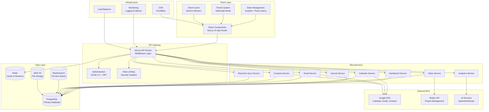

# Ultimate Assistant Hub - System Architecture

## Overview

The Ultimate Assistant Hub is a comprehensive web application that consolidates six essential productivity modules into a unified, modern interface. This architecture prioritizes performance, scalability, maintainability, and user experience while implementing cutting-edge web technologies and design patterns.

## System Architecture Diagram



## Technology Stack

### Frontend
- **Next.js 15.1.0** - React framework with App Router and Server Components
- **React 18.3.0** - UI library with concurrent features
- **TypeScript 5.6.0** - Type safety and enhanced developer experience
- **Tailwind CSS 4.0.0** - Utility-first CSS framework with glassmorphism design
- **Framer Motion 11.0.0** - Animations and transitions
- **Zustand 5.0.0** - Lightweight state management
- **TanStack Query 5.0.0** - Server state management and caching
- **React Hook Form 7.53.0** - Form handling with validation
- **Zod 3.23.0** - Schema validation

### Backend
- **Node.js 22.0.0** - Runtime environment
- **Next.js API Routes** - Backend API endpoints
- **Prisma 6.0.0** - Database ORM and migrations
- **PostgreSQL 16.0** - Primary database
- **Redis 8.0.0** - Caching and session storage
- **Elasticsearch 8.15.0** - Full-text search
- **WebSocket (Socket.io 4.8.0)** - Real-time communication

### DevOps & Infrastructure
- **Vercel** - Hosting and deployment
- **Cloudflare** - CDN and security
- **AWS S3** - File storage
- **Docker** - Containerization
- **GitHub Actions** - CI/CD pipeline

### External Integrations
- **Google APIs** - Calendar, Gmail, Contacts
- **Motion API** - Project management
- **OpenAI API / Anthropic Claude** - AI-powered insights

## Database Schema Design

### Core Tables

```sql
-- Users table
CREATE TABLE users (
    id UUID PRIMARY KEY DEFAULT gen_random_uuid(),
    email VARCHAR(255) UNIQUE NOT NULL,
    name VARCHAR(255) NOT NULL,
    avatar_url TEXT,
    timezone VARCHAR(50) DEFAULT 'UTC',
    theme_preference VARCHAR(20) DEFAULT 'system',
    created_at TIMESTAMP DEFAULT NOW(),
    updated_at TIMESTAMP DEFAULT NOW()
);

-- Journal entries
CREATE TABLE journal_entries (
    id UUID PRIMARY KEY DEFAULT gen_random_uuid(),
    user_id UUID REFERENCES users(id) ON DELETE CASCADE,
    title TEXT,
    content TEXT NOT NULL,
    mood_score INTEGER CHECK (mood_score >= 1 AND mood_score <= 10),
    tags TEXT[],
    is_private BOOLEAN DEFAULT true,
    created_at TIMESTAMP DEFAULT NOW(),
    updated_at TIMESTAMP DEFAULT NOW()
);

-- Tasks and projects
CREATE TABLE tasks (
    id UUID PRIMARY KEY DEFAULT gen_random_uuid(),
    user_id UUID REFERENCES users(id) ON DELETE CASCADE,
    title TEXT NOT NULL,
    description TEXT,
    status VARCHAR(20) DEFAULT 'todo' CHECK (status IN ('todo', 'in_progress', 'completed', 'cancelled')),
    priority VARCHAR(10) DEFAULT 'medium' CHECK (priority IN ('low', 'medium', 'high', 'urgent')),
    due_date TIMESTAMP,
    completed_at TIMESTAMP,
    motion_task_id VARCHAR(100),
    created_at TIMESTAMP DEFAULT NOW(),
    updated_at TIMESTAMP DEFAULT NOW()
);

-- Calendar events
CREATE TABLE calendar_events (
    id UUID PRIMARY KEY DEFAULT gen_random_uuid(),
    user_id UUID REFERENCES users(id) ON DELETE CASCADE,
    google_event_id VARCHAR(255) UNIQUE,
    title TEXT NOT NULL,
    description TEXT,
    start_time TIMESTAMP NOT NULL,
    end_time TIMESTAMP NOT NULL,
    location TEXT,
    attendees JSONB,
    status VARCHAR(20) DEFAULT 'confirmed',
    created_at TIMESTAMP DEFAULT NOW(),
    updated_at TIMESTAMP DEFAULT NOW()
);

-- Email sync
CREATE TABLE email_messages (
    id UUID PRIMARY KEY DEFAULT gen_random_uuid(),
    user_id UUID REFERENCES users(id) ON DELETE CASCADE,
    gmail_message_id VARCHAR(255) UNIQUE,
    thread_id VARCHAR(255),
    subject TEXT,
    from_address TEXT,
    to_addresses TEXT[],
    body_text TEXT,
    body_html TEXT,
    is_read BOOLEAN DEFAULT false,
    is_starred BOOLEAN DEFAULT false,
    labels TEXT[],
    received_at TIMESTAMP,
    created_at TIMESTAMP DEFAULT NOW()
);

-- Contacts
CREATE TABLE contacts (
    id UUID PRIMARY KEY DEFAULT gen_random_uuid(),
    user_id UUID REFERENCES users(id) ON DELETE CASCADE,
    google_contact_id VARCHAR(255) UNIQUE,
    name TEXT NOT NULL,
    email_addresses TEXT[],
    phone_numbers TEXT[],
    company TEXT,
    notes TEXT,
    avatar_url TEXT,
    created_at TIMESTAMP DEFAULT NOW(),
    updated_at TIMESTAMP DEFAULT NOW()
);

-- Analytics and insights
CREATE TABLE user_analytics (
    id UUID PRIMARY KEY DEFAULT gen_random_uuid(),
    user_id UUID REFERENCES users(id) ON DELETE CASCADE,
    date DATE NOT NULL,
    tasks_completed INTEGER DEFAULT 0,
    journal_entries INTEGER DEFAULT 0,
    calendar_events INTEGER DEFAULT 0,
    emails_processed INTEGER DEFAULT 0,
    productivity_score DECIMAL(3,2),
    insights JSONB,
    created_at TIMESTAMP DEFAULT NOW()
);
```

## API Integration Patterns

### Google Services Integration

```typescript
// OAuth 2.0 Flow
class GoogleAuthService {
  async getAuthUrl(userId: string): Promise<string> {
    const state = crypto.randomBytes(16).toString('hex');
    await redis.setex(`oauth_state:${state}`, 600, userId);

    return `https://accounts.google.com/oauth/authorize?` +
      `client_id=${process.env.GOOGLE_CLIENT_ID}&` +
      `redirect_uri=${process.env.GOOGLE_REDIRECT_URI}&` +
      `scope=${encodeURIComponent(GOOGLE_SCOPES)}&` +
      `response_type=code&state=${state}`;
  }

  async exchangeCodeForTokens(code: string, state: string): Promise<TokenResponse> {
    const userId = await redis.get(`oauth_state:${state}`);
    if (!userId) throw new Error('Invalid state parameter');

    const response = await fetch('https://oauth2.googleapis.com/token', {
      method: 'POST',
      headers: { 'Content-Type': 'application/x-www-form-urlencoded' },
      body: new URLSearchParams({
        client_id: process.env.GOOGLE_CLIENT_ID!,
        client_secret: process.env.GOOGLE_CLIENT_SECRET!,
        code,
        grant_type: 'authorization_code',
        redirect_uri: process.env.GOOGLE_REDIRECT_URI!,
      }),
    });

    return response.json();
  }
}

// Calendar API Service
class CalendarService {
  async syncEvents(userId: string): Promise<void> {
    const tokens = await this.getValidTokens(userId);
    const lastSync = await this.getLastSyncTime(userId);

    const response = await fetch(
      `https://www.googleapis.com/calendar/v3/calendars/primary/events?` +
      `timeMin=${lastSync}&singleEvents=true&orderBy=startTime`,
      {
        headers: {
          'Authorization': `Bearer ${tokens.access_token}`,
        },
      }
    );

    const events = await response.json();
    await this.saveEvents(userId, events.items);
  }
}
```

### Motion API Integration

```typescript
class MotionService {
  private client: MotionClient;

  constructor(apiKey: string) {
    this.client = new MotionClient({
      apiKey,
      baseURL: 'https://api.usemotion.com/v1',
    });
  }

  async createTask(taskData: CreateTaskRequest): Promise<Task> {
    return this.client.post('/tasks', taskData);
  }

  async syncTasks(userId: string): Promise<void> {
    const motionTasks = await this.client.get('/tasks');
    await this.syncWithLocalTasks(userId, motionTasks);
  }
}
```

## Component Architecture

### Directory Structure
```
src/
├── app/                          # Next.js App Router
│   ├── (dashboard)/             # Route groups
│   │   ├── dashboard/
│   │   ├── journal/
│   │   ├── tasks/
│   │   ├── calendar/
│   │   ├── email/
│   │   └── contacts/
│   ├── api/                     # API routes
│   ├── globals.css
│   ├── layout.tsx
│   └── page.tsx
├── components/                  # React components
│   ├── ui/                     # Base UI components
│   │   ├── button.tsx
│   │   ├── card.tsx
│   │   ├── input.tsx
│   │   └── modal.tsx
│   ├── layout/                 # Layout components
│   │   ├── header.tsx
│   │   ├── sidebar.tsx
│   │   └── navigation.tsx
│   ├── dashboard/              # Feature components
│   ├── journal/
│   ├── tasks/
│   ├── calendar/
│   ├── email/
│   └── contacts/
├── lib/                        # Utilities and configurations
│   ├── auth.ts
│   ├── db.ts
│   ├── validations.ts
│   └── utils.ts
├── stores/                     # Zustand stores
│   ├── auth-store.ts
│   ├── theme-store.ts
│   └── sync-store.ts
├── hooks/                      # Custom React hooks
│   ├── use-auth.ts
│   ├── use-sync.ts
│   └── use-analytics.ts
└── styles/                     # CSS and design tokens
    ├── globals.css
    └── theme.css
```

### Component Design Patterns

```typescript
// Base UI Component with Glassmorphism
interface CardProps {
  children: React.ReactNode;
  variant?: 'default' | 'glass' | 'solid';
  className?: string;
}

export const Card: React.FC<CardProps> = ({
  children,
  variant = 'glass',
  className
}) => {
  const variants = {
    glass: 'backdrop-blur-xl bg-white/10 border border-white/20 shadow-lg',
    solid: 'bg-white dark:bg-gray-800 border border-gray-200 dark:border-gray-700',
    default: 'bg-gray-50 dark:bg-gray-900 border border-gray-200 dark:border-gray-700'
  };

  return (
    <div className={`rounded-2xl p-6 transition-all duration-300 ${variants[variant]} ${className}`}>
      {children}
    </div>
  );
};

// Feature Component Example
const DashboardWidget: React.FC<{
  title: string;
  children: React.ReactNode;
  loading?: boolean;
}> = ({ title, children, loading }) => {
  return (
    <Card variant="glass" className="hover:scale-[1.02] transition-transform">
      <div className="flex items-center justify-between mb-4">
        <h3 className="text-lg font-semibold text-gray-900 dark:text-white">
          {title}
        </h3>
        {loading && <LoadingSpinner />}
      </div>
      {children}
    </Card>
  );
};
```

## State Management Strategy

### Zustand Store Architecture

```typescript
// Auth Store
interface AuthState {
  user: User | null;
  isLoading: boolean;
  isAuthenticated: boolean;
  login: (email: string, password: string) => Promise<void>;
  logout: () => void;
  refreshToken: () => Promise<void>;
}

export const useAuthStore = create<AuthState>()(
  devtools(
    persist(
      (set, get) => ({
        user: null,
        isLoading: false,
        isAuthenticated: false,

        login: async (email, password) => {
          set({ isLoading: true });
          try {
            const response = await authService.login(email, password);
            set({
              user: response.user,
              isAuthenticated: true,
              isLoading: false
            });
          } catch (error) {
            set({ isLoading: false });
            throw error;
          }
        },

        logout: () => {
          set({ user: null, isAuthenticated: false });
          authService.logout();
        },

        refreshToken: async () => {
          const { user } = get();
          if (user) {
            const refreshedUser = await authService.refreshToken();
            set({ user: refreshedUser });
          }
        },
      }),
      {
        name: 'auth-storage',
        partialize: (state) => ({
          user: state.user,
          isAuthenticated: state.isAuthenticated
        }),
      }
    )
  )
);

// Theme Store
interface ThemeState {
  theme: 'light' | 'dark' | 'system';
  setTheme: (theme: 'light' | 'dark' | 'system') => void;
  resolvedTheme: 'light' | 'dark';
}

export const useThemeStore = create<ThemeState>()(
  devtools(
    persist(
      (set) => ({
        theme: 'system',
        resolvedTheme: 'dark',

        setTheme: (theme) => {
          set({ theme });
          // Apply theme to document
          document.documentElement.classList.remove('light', 'dark');
          document.documentElement.classList.add(
            theme === 'system'
              ? window.matchMedia('(prefers-color-scheme: dark)').matches ? 'dark' : 'light'
              : theme
          );
        },
      }),
      { name: 'theme-storage' }
    )
  )
);

// Sync Store for Real-time Data
interface SyncState {
  isOnline: boolean;
  lastSync: Date | null;
  pendingChanges: PendingChange[];
  addPendingChange: (change: PendingChange) => void;
  syncChanges: () => Promise<void>;
}

export const useSyncStore = create<SyncState>()(
  devtools(
    (set, get) => ({
      isOnline: navigator.onLine,
      lastSync: null,
      pendingChanges: [],

      addPendingChange: (change) => {
        set(state => ({
          pendingChanges: [...state.pendingChanges, change]
        }));
      },

      syncChanges: async () => {
        const { pendingChanges } = get();
        if (pendingChanges.length === 0) return;

        try {
          await syncService.syncChanges(pendingChanges);
          set({
            pendingChanges: [],
            lastSync: new Date()
          });
        } catch (error) {
          console.error('Sync failed:', error);
        }
      },
    })
  )
);
```

### Server State Management with TanStack Query

```typescript
// API hooks
export const useTasks = () => {
  return useQuery({
    queryKey: ['tasks'],
    queryFn: () => apiClient.get('/api/tasks'),
    staleTime: 1000 * 60 * 5, // 5 minutes
    refetchOnWindowFocus: false,
  });
};

export const useCreateTask = () => {
  const queryClient = useQueryClient();

  return useMutation({
    mutationFn: (taskData: CreateTaskData) =>
      apiClient.post('/api/tasks', taskData),
    onSuccess: () => {
      queryClient.invalidateQueries({ queryKey: ['tasks'] });
      queryClient.invalidateQueries({ queryKey: ['dashboard'] });
    },
  });
};

// Real-time sync with WebSocket
export const useRealTimeSync = () => {
  const { addPendingChange, syncChanges } = useSyncStore();

  useEffect(() => {
    const socket = io(process.env.NEXT_PUBLIC_WS_URL!);

    socket.on('connect', () => {
      console.log('Connected to sync server');
      syncChanges();
    });

    socket.on('data-changed', (data) => {
      // Handle real-time updates
      queryClient.setQueryData([data.type, data.id], data.payload);
    });

    socket.on('disconnect', () => {
      console.log('Disconnected from sync server');
    });

    return () => socket.disconnect();
  }, [syncChanges]);
};
```

## Performance Optimization

### 1. Code Splitting and Lazy Loading

```typescript
// Dynamic imports for route-based code splitting
const Dashboard = dynamic(() => import('@/components/dashboard/Dashboard'), {
  loading: () => <SkeletonLoader />,
  ssr: false,
});

const Journal = dynamic(() => import('@/components/journal/Journal'), {
  loading: () => <SkeletonLoader />,
  ssr: false,
});

// Component-level lazy loading
const ChartComponent = lazy(() => import('@/components/ui/Chart'));
```

### 2. Caching Strategy

```typescript
// API route caching
export async function GET(request: Request) {
  const { searchParams } = new URL(request.url);
  const cacheKey = `dashboard:${searchParams.toString()}`;

  // Try cache first
  const cached = await redis.get(cacheKey);
  if (cached) {
    return NextResponse.json(cached);
  }

  // Generate fresh data
  const data = await generateDashboardData(searchParams);

  // Cache for 5 minutes
  await redis.setex(cacheKey, 300, data);

  return NextResponse.json(data);
}

// Client-side caching with Service Worker
// sw.js
self.addEventListener('fetch', (event) => {
  if (event.request.url.includes('/api/')) {
    event.respondWith(
      caches.open('api-cache').then((cache) => {
        return cache.match(event.request).then((response) => {
          return response || fetch(event.request).then((fetchResponse) => {
            cache.put(event.request, fetchResponse.clone());
            return fetchResponse;
          });
        });
      })
    );
  }
});
```

### 3. Image and Asset Optimization

```typescript
// Next.js Image component with optimization
import Image from 'next/image';

const OptimizedImage: React.FC<{
  src: string;
  alt: string;
  width: number;
  height: number;
}> = ({ src, alt, width, height }) => {
  return (
    <Image
      src={src}
      alt={alt}
      width={width}
      height={height}
      placeholder="blur"
      blurDataURL="data:image/jpeg;base64,/9j/4AAQSkZJRgABAQAAAQABAAD/2wBDAAYEBQYFBAYGBQYHBwYIChAKCgkJChQODwwQFxQYGBcUFhYaHSUfGhsjHBYWICwgIyYnKSopGR8tMC0oMCUoKSj/2wBDAQcHBwoIChMKChMoGhYaKCgoKCgoKCgoKCgoKCgoKCgoKCgoKCgoKCgoKCgoKCgoKCgoKCgoKCgoKCgoKCgoKCj/wAARCAABAAEDASIAAhEBAxEB/8QAFQABAQAAAAAAAAAAAAAAAAAAAAv/xAAUEAEAAAAAAAAAAAAAAAAAAAAA/8QAFQEBAQAAAAAAAAAAAAAAAAAAAAX/xAAUEQEAAAAAAAAAAAAAAAAAAAAA/9oADAMBAAIRAxEAPwA/8A8A"
      className="rounded-lg transition-transform hover:scale-105"
    />
  );
};
```

### 4. Bundle Optimization

```javascript
// next.config.js
module.exports = {
  experimental: {
    optimizeCss: true,
    swcMinify: true,
  },
  images: {
    domains: ['example.com'],
    formats: ['image/webp', 'image/avif'],
  },
  webpack: (config, { isServer }) => {
    if (!isServer) {
      config.resolve.fallback.fs = false;
      config.optimization.splitChunks = {
        chunks: 'all',
        cacheGroups: {
          vendor: {
            test: /[\\/]node_modules[\\/]/,
            name: 'vendors',
            chunks: 'all',
          },
        },
      };
    }
    return config;
  },
};
```

## Security Considerations

### 1. Authentication & Authorization

```typescript
// JWT middleware for API routes
import jwt from 'jsonwebtoken';

export async function withAuth(
  request: Request,
  handler: (userId: string) => Promise<Response>
): Promise<Response> {
  const token = request.headers.get('Authorization')?.replace('Bearer ', '');

  if (!token) {
    return NextResponse.json({ error: 'Unauthorized' }, { status: 401 });
  }

  try {
    const decoded = jwt.verify(token, process.env.JWT_SECRET!) as { userId: string };
    return handler(decoded.userId);
  } catch (error) {
    return NextResponse.json({ error: 'Invalid token' }, { status: 401 });
  }
}

// Rate limiting
import rateLimit from 'express-rate-limit';

export const apiLimiter = rateLimit({
  windowMs: 15 * 60 * 1000, // 15 minutes
  max: 100, // Limit each IP to 100 requests per windowMs
  message: 'Too many requests from this IP',
});
```

### 2. Data Validation & Sanitization

```typescript
// Zod schemas for validation
import { z } from 'zod';

const CreateTaskSchema = z.object({
  title: z.string().min(1).max(255),
  description: z.string().max(1000).optional(),
  priority: z.enum(['low', 'medium', 'high', 'urgent']),
  dueDate: z.string().datetime().optional(),
});

// API route validation
export async function POST(request: Request) {
  try {
    const body = await request.json();
    const validatedData = CreateTaskSchema.parse(body);

    // Process validated data
    const task = await createTask(validatedData);

    return NextResponse.json(task);
  } catch (error) {
    if (error instanceof z.ZodError) {
      return NextResponse.json(
        { error: 'Invalid data', details: error.errors },
        { status: 400 }
      );
    }
    return NextResponse.json(
      { error: 'Internal server error' },
      { status: 500 }
    );
  }
}
```

### 3. Environment Security

```typescript
// Secure environment configuration
const config = {
  databaseUrl: process.env.DATABASE_URL,
  jwtSecret: process.env.JWT_SECRET,
  googleClientId: process.env.GOOGLE_CLIENT_ID,
  encryptionKey: process.env.ENCRYPTION_KEY,

  // Validate required environment variables
  validate() {
    const required = ['DATABASE_URL', 'JWT_SECRET', 'ENCRYPTION_KEY'];
    const missing = required.filter(key => !this[key]);

    if (missing.length > 0) {
      throw new Error(`Missing environment variables: ${missing.join(', ')}`);
    }
  }
};

// Data encryption for sensitive information
import crypto from 'crypto';

class EncryptionService {
  private key: Buffer;

  constructor() {
    this.key = Buffer.from(process.env.ENCRYPTION_KEY!, 'hex');
  }

  encrypt(text: string): string {
    const iv = crypto.randomBytes(16);
    const cipher = crypto.createCipher('aes-256-cbc', this.key);

    let encrypted = cipher.update(text, 'utf8', 'hex');
    encrypted += cipher.final('hex');

    return iv.toString('hex') + ':' + encrypted;
  }

  decrypt(encryptedData: string): string {
    const [ivHex, encrypted] = encryptedData.split(':');
    const iv = Buffer.from(ivHex, 'hex');
    const decipher = crypto.createDecipher('aes-256-cbc', this.key);

    let decrypted = decipher.update(encrypted, 'hex', 'utf8');
    decrypted += decipher.final('utf8');

    return decrypted;
  }
}
```

### 4. CORS & Security Headers

```typescript
// next.config.js security headers
const securityHeaders = [
  {
    key: 'X-DNS-Prefetch-Control',
    value: 'on',
  },
  {
    key: 'Strict-Transport-Security',
    value: 'max-age=63072000; includeSubDomains; preload',
  },
  {
    key: 'X-XSS-Protection',
    value: '1; mode=block',
  },
  {
    key: 'X-Frame-Options',
    value: 'DENY',
  },
  {
    key: 'X-Content-Type-Options',
    value: 'nosniff',
  },
  {
    key: 'Referrer-Policy',
    value: 'origin-when-cross-origin',
  },
  {
    key: 'Content-Security-Policy',
    value: "default-src 'self'; script-src 'self' 'unsafe-eval' 'unsafe-inline'; style-src 'self' 'unsafe-inline'; img-src 'self' data: https:; font-src 'self' data:;",
  },
];

module.exports = {
  async headers() {
    return [
      {
        source: '/(.*)',
        headers: securityHeaders,
      },
    ];
  },
};
```

## Glassmorphism Design System

### Design Tokens

```css
/* styles/theme.css */
:root {
  /* Glassmorphism variables */
  --glass-bg: rgba(255, 255, 255, 0.1);
  --glass-border: rgba(255, 255, 255, 0.2);
  --glass-shadow: 0 8px 32px 0 rgba(31, 38, 135, 0.37);
  --glass-blur: blur(8px);

  /* Gender-neutral color palette */
  --primary-50: #f0f9ff;
  --primary-500: #3b82f6;
  --primary-900: #1e3a8a;

  --accent-50: #fef3c7;
  --accent-500: #f59e0b;
  --accent-900: #78350f;

  --neutral-50: #fafafa;
  --neutral-500: #737373;
  --neutral-900: #171717;

  /* Semantic colors */
  --success: #10b981;
  --warning: #f59e0b;
  --error: #ef4444;
  --info: #3b82f6;
}

[data-theme="dark"] {
  --glass-bg: rgba(0, 0, 0, 0.3);
  --glass-border: rgba(255, 255, 255, 0.1);
  --glass-shadow: 0 8px 32px 0 rgba(0, 0, 0, 0.5);
}

/* Glassmorphism utility classes */
.glass {
  background: var(--glass-bg);
  backdrop-filter: var(--glass-blur);
  border: 1px solid var(--glass-border);
  box-shadow: var(--glass-shadow);
}

.glass-card {
  @apply glass rounded-2xl p-6 transition-all duration-300 hover:scale-[1.02];
}

.glass-button {
  @apply glass rounded-lg px-6 py-3 font-medium transition-all duration-300 hover:bg-white/20 active:scale-95;
}
```

## Implementation Roadmap

### Phase 1: Foundation (Weeks 1-2)
- Set up Next.js 15 project with TypeScript
- Configure Tailwind CSS with glassmorphism design system
- Implement authentication system
- Set up database schema with Prisma
- Create base UI components

### Phase 2: Core Modules (Weeks 3-6)
- Dashboard module with analytics
- Journal module with rich text editing
- Tasks module with CRUD operations
- Basic calendar integration
- Real-time sync infrastructure

### Phase 3: Advanced Features (Weeks 7-10)
- Google API integrations (Calendar, Gmail, Contacts)
- Motion API integration
- Advanced analytics and AI insights
- Email processing and management
- Contact synchronization

### Phase 4: Performance & Polish (Weeks 11-12)
- Performance optimization
- Caching strategies
- Security hardening
- Testing and QA
- Deployment and monitoring

This architecture provides a solid foundation for a scalable, modern web application that integrates seamlessly with multiple external services while maintaining excellent performance and user experience. The modular design allows for easy maintenance and future enhancements.