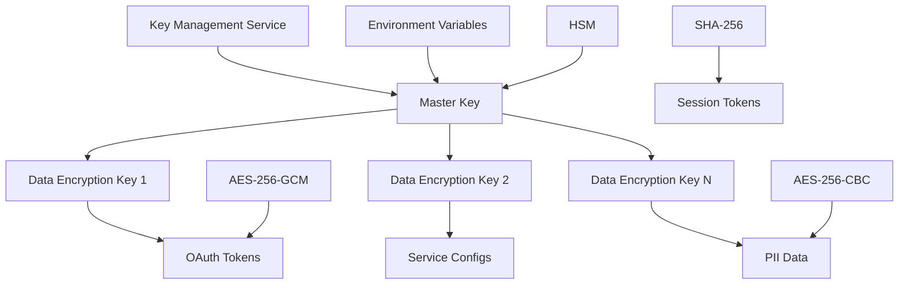

# Data Encryption Strategy

## Overview

This document outlines the comprehensive encryption strategy for securing sensitive OAuth authentication data, including credentials, tokens, and personally identifiable information (PII).

## Encryption Requirements

### Data Classification

| Data Type | Classification | Encryption Level | Storage Location |
|-----------|----------------|------------------|------------------|
| Access Tokens | Highly Sensitive | AES-256-GCM | `oauth_tokens.access_token_encrypted` |
| Refresh Tokens | Highly Sensitive | AES-256-GCM | `oauth_tokens.refresh_token_encrypted` |
| Client Secrets | Highly Sensitive | AES-256-GCM | `service_configs.client_secret_encrypted` |
| User Emails | PII | AES-256-CBC | `users.email` (optional) |
| Phone Numbers | PII | AES-256-CBC | `users.phone_number` |
| Session Tokens | Sensitive | Hashed (SHA-256) | `user_sessions.session_token` |
| API Keys | Highly Sensitive | AES-256-GCM | Configuration/Environment |

## Encryption Architecture

### Key Management



### Encryption Algorithm Selection

- **AES-256-GCM**: For OAuth tokens and API credentials
  - Authenticated encryption with integrity protection
  - Resistant to tampering attacks
  - High performance with hardware acceleration

- **AES-256-CBC**: For PII data
  - Industry standard for data at rest
  - Compatible with most encryption libraries
  - Requires separate HMAC for integrity

- **SHA-256**: For session tokens
  - Cryptographic hashing (one-way)
  - Fast verification
  - Salted for rainbow table protection

## Implementation Details

### Encryption Utility Library

```typescript
// encryption.ts
import crypto from 'crypto';
import { config } from 'dotenv';

// Load environment variables
config();

interface EncryptionResult {
  encrypted: string;
  iv: string;
  tag?: string; // For GCM mode
  algorithm: string;
}

interface DecryptionOptions {
  iv: string;
  tag?: string; // For GCM mode
  algorithm: string;
}

class EncryptionManager {
  private masterKey: Buffer;
  private readonly ALGORITHM_GCM = 'aes-256-gcm';
  private readonly ALGORITHM_CBC = 'aes-256-cbc';
  private readonly IV_LENGTH = 16;
  private readonly TAG_LENGTH = 16;
  private readonly SALT_LENGTH = 32;

  constructor() {
    this.masterKey = this.getMasterKey();
  }

  private getMasterKey(): Buffer {
    const key = process.env.MASTER_ENCRYPTION_KEY;
    if (!key) {
      throw new Error('MASTER_ENCRYPTION_KEY environment variable is required');
    }
    return Buffer.from(key, 'hex');
  }

  private deriveKey(salt: Buffer): Buffer {
    return crypto.pbkdf2Sync(this.masterKey, salt, 100000, 32, 'sha256');
  }

  // AES-256-GCM Encryption (for OAuth tokens)
  encryptGCM(plaintext: string): EncryptionResult {
    const salt = crypto.randomBytes(this.SALT_LENGTH);
    const key = this.deriveKey(salt);
    const iv = crypto.randomBytes(this.IV_LENGTH);

    const cipher = crypto.createCipher(this.ALGORITHM_GCM, key, iv);

    let encrypted = cipher.update(plaintext, 'utf8', 'hex');
    encrypted += cipher.final('hex');

    const tag = cipher.getAuthTag();

    return {
      encrypted,
      iv: iv.toString('hex'),
      tag: tag.toString('hex'),
      algorithm: this.ALGORITHM_GCM
    };
  }

  // AES-256-GCM Decryption
  decryptGCM(encryptedData: string, options: DecryptionOptions): string {
    const salt = crypto.randomBytes(this.SALT_LENGTH); // In production, store salt with data
    const key = this.deriveKey(salt);
    const iv = Buffer.from(options.iv, 'hex');
    const tag = Buffer.from(options.tag!, 'hex');

    const decipher = crypto.createDecipher(this.ALGORITHM_GCM, key, iv);
    decipher.setAuthTag(tag);

    let decrypted = decipher.update(encryptedData, 'hex', 'utf8');
    decrypted += decipher.final('utf8');

    return decrypted;
  }

  // AES-256-CBC Encryption (for PII)
  encryptCBC(plaintext: string): EncryptionResult {
    const salt = crypto.randomBytes(this.SALT_LENGTH);
    const key = this.deriveKey(salt);
    const iv = crypto.randomBytes(this.IV_LENGTH);

    const cipher = crypto.createCipher(this.ALGORITHM_CBC, key, iv);

    let encrypted = cipher.update(plaintext, 'utf8', 'hex');
    encrypted += cipher.final('hex');

    return {
      encrypted,
      iv: iv.toString('hex'),
      algorithm: this.ALGORITHM_CBC
    };
  }

  // AES-256-CBC Decryption
  decryptCBC(encryptedData: string, options: DecryptionOptions): string {
    const salt = crypto.randomBytes(this.SALT_LENGTH); // In production, store salt with data
    const key = this.deriveKey(salt);
    const iv = Buffer.from(options.iv, 'hex');

    const decipher = crypto.createDecipher(this.ALGORITHM_CBC, key, iv);

    let decrypted = decipher.update(encryptedData, 'hex', 'utf8');
    decrypted += decipher.final('utf8');

    return decrypted;
  }

  // Hashing for session tokens
  hashSessionToken(token: string, salt?: string): { hash: string; salt: string } {
    const tokenSalt = salt || crypto.randomBytes(this.SALT_LENGTH).toString('hex');
    const hash = crypto.pbkdf2Sync(token, tokenSalt, 100000, 32, 'sha256').toString('hex');

    return { hash, salt: tokenSalt };
  }

  verifySessionToken(token: string, hash: string, salt: string): boolean {
    const { hash: computedHash } = this.hashSessionToken(token, salt);
    return crypto.timingSafeEqual(Buffer.from(hash, 'hex'), Buffer.from(computedHash, 'hex'));
  }

  // Utility to store encrypted data in database
  encryptForDatabase(plaintext: string, type: 'token' | 'config' | 'pii'): string {
    const result = type === 'token' || type === 'config'
      ? this.encryptGCM(plaintext)
      : this.encryptCBC(plaintext);

    return JSON.stringify(result);
  }

  decryptFromDatabase(encryptedData: string): string {
    const { encrypted, iv, tag, algorithm } = JSON.parse(encryptedData);

    return algorithm === this.ALGORITHM_GCM
      ? this.decryptGCM(encrypted, { iv, tag, algorithm })
      : this.decryptCBC(encrypted, { iv, algorithm });
  }
}

export const encryption = new EncryptionManager();
```

### Database Integration

```typescript
// database-encryption.ts
import { encryption } from './encryption';

class DatabaseEncryptionService {
  // Encrypt OAuth tokens before storage
  async encryptOAuthToken(accessToken: string, refreshToken?: string): Promise<{
    access_token_encrypted: string;
    refresh_token_encrypted?: string;
  }> {
    return {
      access_token_encrypted: encryption.encryptForDatabase(accessToken, 'token'),
      refresh_token_encrypted: refreshToken
        ? encryption.encryptForDatabase(refreshToken, 'token')
        : undefined
    };
  }

  // Decrypt OAuth tokens for use
  async decryptOAuthToken(encryptedData: {
    access_token_encrypted: string;
    refresh_token_encrypted?: string;
  }): Promise<{
    access_token: string;
    refresh_token?: string;
  }> {
    return {
      access_token: encryption.decryptFromDatabase(encryptedData.access_token_encrypted),
      refresh_token: encryptedData.refresh_token_encrypted
        ? encryption.decryptFromDatabase(encryptedData.refresh_token_encrypted)
        : undefined
    };
  }

  // Encrypt service configuration secrets
  encryptClientSecret(clientSecret: string): string {
    return encryption.encryptForDatabase(clientSecret, 'config');
  }

  decryptClientSecret(encryptedSecret: string): string {
    return encryption.decryptFromDatabase(encryptedSecret);
  }

  // Hash session tokens
  hashSessionToken(sessionToken: string): { hash: string; salt: string } {
    return encryption.hashSessionToken(sessionToken);
  }

  verifySessionToken(token: string, hash: string, salt: string): boolean {
    return encryption.verifySessionToken(token, hash, salt);
  }
}

export const dbEncryption = new DatabaseEncryptionService();
```

## Key Rotation Strategy

### Automated Key Rotation

```typescript
// key-rotation.ts
interface KeyRotationLog {
  id: string;
  previousKeyId: string;
  newKeyId: string;
  rotatedAt: Date;
  affectedTables: string[];
  status: 'in_progress' | 'completed' | 'failed';
}

class KeyRotationManager {
  private rotationLogs: KeyRotationLog[] = [];

  async rotateEncryptionKey(): Promise<void> {
    const rotationId = crypto.randomUUID();
    const previousKeyId = process.env.MASTER_ENCRYPTION_KEY;

    // Generate new master key
    const newKey = crypto.randomBytes(32).toString('hex');

    // Update environment variable
    process.env.MASTER_ENCRYPTION_KEY = newKey;

    // Log rotation start
    const rotationLog: KeyRotationLog = {
      id: rotationId,
      previousKeyId,
      newKeyId,
      rotatedAt: new Date(),
      affectedTables: ['oauth_tokens', 'service_configs', 'users'],
      status: 'in_progress'
    };

    this.rotationLogs.push(rotationLog);

    try {
      // Re-encrypt all sensitive data
      await this.reencryptOAuthTokens();
      await this.reencryptServiceConfigs();
      await this.reencryptPII();

      // Update rotation log
      rotationLog.status = 'completed';

      // Securely delete old key
      this.securelyDeleteKey(previousKeyId);

    } catch (error) {
      // Rollback on failure
      process.env.MASTER_ENCRYPTION_KEY = previousKeyId;
      rotationLog.status = 'failed';
      throw error;
    }
  }

  private async reencryptOAuthTokens(): Promise<void> {
    // Implementation for re-encrypting OAuth tokens
    // This would be done in batches to avoid memory issues
  }

  private async reencryptServiceConfigs(): Promise<void> {
    // Implementation for re-encrypting service configurations
  }

  private async reencryptPII(): Promise<void> {
    // Implementation for re-encrypting PII data
  }

  private securelyDeleteKey(key: string): void {
    // Overwrite memory containing the old key
    const buffer = Buffer.from(key, 'hex');
    buffer.fill(0);
  }
}

export const keyRotation = new KeyRotationManager();
```

### Scheduled Key Rotation

```typescript
// scheduled-rotation.ts
import cron from 'node-cron';

// Schedule key rotation every 90 days
cron.schedule('0 2 1 */3 *', async () => {
  console.log('Starting scheduled encryption key rotation...');

  try {
    await keyRotation.rotateEncryptionKey();
    console.log('Key rotation completed successfully');
  } catch (error) {
    console.error('Key rotation failed:', error);
    // Send alert to administrators
  }
});
```

## Security Best Practices

### Environment Security

```bash
# .env.example (do not commit actual keys)
MASTER_ENCRYPTION_KEY=your-256-bit-hex-key-here
DB_HOST=localhost
DB_PORT=5432
DB_NAME=oauth_auth
DB_USER=oauth_user
DB_PASSWORD=your_database_password

# Google OAuth
GOOGLE_CLIENT_ID=your_google_client_id
GOOGLE_CLIENT_SECRET_ENCRYPTED=encrypted_google_secret

# Motion API
MOTION_API_KEY_ENCRYPTED=encrypted_motion_api_key
```

### Secure Key Generation

```typescript
// key-generation.ts
import crypto from 'crypto';

function generateMasterKey(): string {
  return crypto.randomBytes(32).toString('hex');
}

function generateSecurePassword(length: number = 32): string {
  const charset = 'ABCDEFGHIJKLMNOPQRSTUVWXYZabcdefghijklmnopqrstuvwxyz0123456789!@#$%^&*';
  let password = '';

  for (let i = 0; i < length; i++) {
    const randomIndex = crypto.randomInt(0, charset.length);
    password += charset[randomIndex];
  }

  return password;
}

// Generate and display new keys (for initial setup)
console.log('Generated Master Encryption Key:', generateMasterKey());
console.log('Generated Secure Password:', generateSecurePassword());
```

### Memory Protection

```typescript
// secure-memory.ts
class SecureString {
  private buffer: Buffer;
  private wiped = false;

  constructor(value: string) {
    this.buffer = Buffer.from(value, 'utf8');
    // Overwrite the original string
    value = '';
  }

  toString(): string {
    if (this.wiped) {
      throw new Error('SecureString has been wiped');
    }
    return this.buffer.toString('utf8');
  }

  wipe(): void {
    if (!this.wiped) {
      this.buffer.fill(0);
      this.wiped = true;
    }
  }

  // Ensure memory is cleaned up
  finalize(): void {
    this.wipe();
  }
}

// Usage example
function handleSecret(secret: string): void {
  const secureSecret = new SecureString(secret);

  try {
    // Use the secret
    console.log('Processing secret:', secureSecret.toString().substr(0, 3) + '...');
  } finally {
    // Always wipe the secret when done
    secureSecret.wipe();
  }
}
```

## Compliance and Auditing

### Encryption Audit Trail

```sql
-- Create audit table for encryption operations
CREATE TABLE encryption_audit_log (
    id TEXT PRIMARY KEY,
    operation TEXT NOT NULL, -- 'encrypt', 'decrypt', 'rotate_key'
    table_name TEXT NOT NULL,
    record_id TEXT NOT NULL,
    field_name TEXT NOT NULL,
    key_version TEXT NOT NULL,
    timestamp TIMESTAMP DEFAULT CURRENT_TIMESTAMP,
    user_id TEXT,
    ip_address TEXT,
    success BOOLEAN NOT NULL,
    error_message TEXT
);

-- Indexes for audit queries
CREATE INDEX idx_encryption_audit_timestamp ON encryption_audit_log(timestamp DESC);
CREATE INDEX idx_encryption_audit_operation ON encryption_audit_log(operation, timestamp DESC);
CREATE INDEX idx_encryption_audit_table ON encryption_audit_log(table_name, timestamp DESC);
```

### Data Access Monitoring

```typescript
// access-monitoring.ts
class AccessMonitor {
  private auditLog: any[] = [];

  async logAccess(
    operation: string,
    tableName: string,
    recordId: string,
    fieldName: string,
    userId?: string,
    success: boolean = true,
    errorMessage?: string
  ): Promise<void> {
    const auditEntry = {
      id: crypto.randomUUID(),
      operation,
      tableName,
      recordId,
      fieldName,
      keyVersion: process.env.MASTER_ENCRYPTION_KEY?.substr(0, 8) || 'unknown',
      timestamp: new Date(),
      userId,
      ipAddress: this.getClientIP(),
      success,
      errorMessage
    };

    this.auditLog.push(auditEntry);

    // Also store in database for permanent audit trail
    await this.storeAuditEntry(auditEntry);
  }

  private async storeAuditEntry(entry: any): Promise<void> {
    // Implementation to store audit entry in database
  }

  private getClientIP(): string {
    // Implementation to get client IP address
    return '127.0.0.1'; // placeholder
  }
}

export const accessMonitor = new AccessMonitor();
```

## Testing and Validation

### Encryption Testing Suite

```typescript
// encryption-test.ts
import { encryption } from './encryption';

describe('Encryption Manager Tests', () => {
  const testData = 'This is a secret OAuth token for testing';

  describe('GCM Encryption', () => {
    it('should encrypt and decrypt correctly', () => {
      const encrypted = encryption.encryptGCM(testData);
      const decrypted = encryption.decryptGCM(encrypted.encrypted, {
        iv: encrypted.iv,
        tag: encrypted.tag!,
        algorithm: encrypted.algorithm
      });

      expect(decrypted).toBe(testData);
    });

    it('should produce different ciphertexts for same input', () => {
      const encrypted1 = encryption.encryptGCM(testData);
      const encrypted2 = encryption.encryptGCM(testData);

      expect(encrypted1.encrypted).not.toBe(encrypted2.encrypted);
    });
  });

  describe('Session Token Hashing', () => {
    it('should hash and verify tokens correctly', () => {
      const token = 'session_token_12345';
      const { hash, salt } = encryption.hashSessionToken(token);

      expect(encryption.verifySessionToken(token, hash, salt)).toBe(true);
      expect(encryption.verifySessionToken('wrong_token', hash, salt)).toBe(false);
    });
  });

  describe('Database Encryption Integration', () => {
    it('should handle database storage format', () => {
      const encrypted = encryption.encryptForDatabase(testData, 'token');
      const decrypted = encryption.decryptFromDatabase(encrypted);

      expect(decrypted).toBe(testData);
    });
  });
});
```

This comprehensive encryption strategy ensures that all sensitive OAuth authentication data is protected both at rest and in transit, with proper key management, rotation, and auditing capabilities.