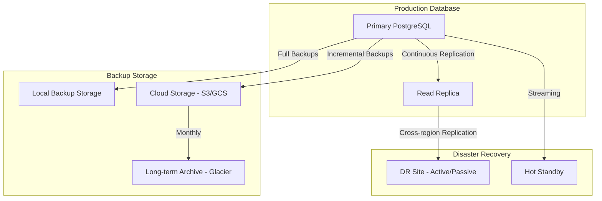

# Backup and Recovery Strategy

## Overview

This document outlines a comprehensive backup and recovery strategy for the OAuth authentication database, ensuring data integrity, high availability, and disaster recovery capabilities.

## Backup Requirements

### Recovery Time Objective (RTO) and Recovery Point Objective (RPO)

| Data Type | RTO | RPO | Backup Frequency |
|-----------|-----|-----|------------------|
| User Accounts | 1 hour | 15 minutes | Every 15 minutes |
| OAuth Tokens | 15 minutes | 5 minutes | Every 5 minutes |
| Audit Logs | 4 hours | 1 hour | Every hour |
| Configuration | 30 minutes | Immediate | Real-time replication |

## Backup Architecture

### Multi-tiered Backup Strategy



## Backup Implementation

### 1. PostgreSQL Native Backups

#### Physical Backups (pg_basebackup)

```bash
#!/bin/bash
# physical_backup.sh

set -euo pipefail

# Configuration
DB_HOST="localhost"
DB_PORT="5432"
DB_USER="postgres"
DB_NAME="oauth_auth"
BACKUP_DIR="/backups/physical"
S3_BUCKET="oauth-db-backups"
RETENTION_DAYS=30

# Create backup directory
mkdir -p "$BACKUP_DIR"
TIMESTAMP=$(date +%Y%m%d_%H%M%S)
BACKUP_PATH="$BACKUP_DIR/oauth_auth_$TIMESTAMP"

echo "Starting physical backup at $(date)"

# Create base backup
pg_basebackup \
    -h "$DB_HOST" \
    -p "$DB_PORT" \
    -U "$DB_USER" \
    -D "$BACKUP_PATH" \
    -Ft \
    -z \
    -P \
    -W \
    -v

# Verify backup
if [ $? -eq 0 ]; then
    echo "Physical backup completed successfully"

    # Upload to S3
    tar -czf "$BACKUP_PATH.tar.gz" -C "$BACKUP_PATH" .
    aws s3 cp "$BACKUP_PATH.tar.gz" "s3://$S3_BUCKET/physical/$(basename $BACKUP_PATH.tar.gz)"

    # Clean up local file
    rm -rf "$BACKUP_PATH" "$BACKUP_PATH.tar.gz"

    echo "Backup uploaded to S3"
else
    echo "Physical backup failed"
    exit 1
fi

# Clean up old backups
find "$BACKUP_DIR" -name "*.tar.gz" -mtime +$RETENTION_DAYS -delete
aws s3 ls "s3://$S3_BUCKET/physical/" | while read -r line; do
    createDate=$(echo "$line" | awk '{print $1" "$2}')
    createDate=$(date -d "$createDate" +%s)
    olderThan=$(date -d "$RETENTION_DAYS days ago" +%s)
    if [[ $createDate -lt $olderThan ]]; then
        fileName=$(echo "$line" | awk '{print $4}')
        aws s3 rm "s3://$S3_BUCKET/physical/$fileName"
    fi
done
```

#### Logical Backups (pg_dump)

```bash
#!/bin/bash
# logical_backup.sh

set -euo pipefail

# Configuration
DB_HOST="localhost"
DB_PORT="5432"
DB_USER="postgres"
DB_NAME="oauth_auth"
BACKUP_DIR="/backups/logical"
S3_BUCKET="oauth-db-backups"
RETENTION_DAYS=7

# Create backup directory
mkdir -p "$BACKUP_DIR"
TIMESTAMP=$(date +%Y%m%d_%H%M%S)
BACKUP_FILE="$BACKUP_DIR/oauth_auth_logical_$TIMESTAMP.sql"

echo "Starting logical backup at $(date)"

# Create compressed dump
pg_dump \
    -h "$DB_HOST" \
    -p "$DB_PORT" \
    -U "$DB_USER" \
    -d "$DB_NAME" \
    --verbose \
    --clean \
    --if-exists \
    --format=custom \
    --compress=9 \
    --file="$BACKUP_FILE"

# Verify backup
if [ $? -eq 0 ]; then
    echo "Logical backup completed successfully"

    # Upload to S3
    aws s3 cp "$BACKUP_FILE" "s3://$S3_BUCKET/logical/$(basename $BACKUP_FILE)"

    # Clean up local file
    rm "$BACKUP_FILE"

    echo "Backup uploaded to S3"
else
    echo "Logical backup failed"
    exit 1
fi

# Clean up old backups
find "$BACKUP_DIR" -name "*.sql" -mtime +$RETENTION_DAYS -delete
aws s3 ls "s3://$S3_BUCKET/logical/" | while read -r line; do
    createDate=$(echo "$line" | awk '{print $1" "$2}')
    createDate=$(date -d "$createDate" +%s)
    olderThan=$(date -d "$RETENTION_DAYS days ago" +%s)
    if [[ $createDate -lt $olderThan ]]; then
        fileName=$(echo "$line" | awk '{print $4}')
        aws s3 rm "s3://$S3_BUCKET/logical/$fileName"
    fi
done
```

### 2. Continuous Archiving (WAL)

#### PostgreSQL Configuration

```sql
-- postgresql.conf settings for WAL archiving

-- Enable WAL archiving
wal_level = replica
archive_mode = on
archive_command = 'aws s3 cp %p s3://oauth-db-backups/wal/%f'

-- WAL retention
wal_keep_segments = 64
archive_timeout = 300  -- 5 minutes

-- Checkpoint settings
checkpoint_completion_target = 0.9
wal_buffers = 16MB
checkpoint_segments = 32
```

#### WAL Archive Management

```bash
#!/bin/bash
# wal_archive_manager.sh

S3_BUCKET="oauth-db-backups"
WAL_DIR="/var/lib/postgresql/14/main/pg_wal"
RETENTION_HOURS=48

echo "Managing WAL archives at $(date)"

# Clean up old WAL files
aws s3 ls "s3://$S3_BUCKET/wal/" | while read -r line; do
    createDate=$(echo "$line" | awk '{print $1" "$2}')
    createDate=$(date -d "$createDate" +%s)
    olderThan=$(date -d "$RETENTION_HOURS hours ago" +%s)
    if [[ $createDate -lt $olderThan ]]; then
        fileName=$(echo "$line" | awk '{print $4}')
        aws s3 rm "s3://$S3_BUCKET/wal/$fileName"
    fi
done

# Verify archive completeness
aws s3 ls "s3://$S3_BUCKET/wal/" | wc -l > /tmp/wal_count
echo "Current WAL files in archive: $(cat /tmp/wal_count)"
```

### 3. Point-in-Time Recovery (PITR)

```bash
#!/bin/bash
# point_in_time_recovery.sh

set -euo pipefail

# Configuration
RECOVERY_TIME="$1"
BACKUP_DIR="/recovery"
DB_NAME="oauth_auth_recovery"
S3_BUCKET="oauth-db-backups"

if [ -z "$RECOVERY_TIME" ]; then
    echo "Usage: $0 'YYYY-MM-DD HH:MI:SS'"
    exit 1
fi

echo "Starting point-in-time recovery to $RECOVERY_TIME"

# Create recovery directory
mkdir -p "$BACKUP_DIR"
cd "$BACKUP_DIR"

# Download latest base backup
LATEST_BACKUP=$(aws s3 ls "s3://$S3_BUCKET/physical/" | sort -r | head -n1 | awk '{print $4}')
echo "Using base backup: $LATEST_BACKUP"

aws s3 cp "s3://$S3_BUCKET/physical/$LATEST_BACKUP" .
tar -xzf "$LATEST_BACKUP"

# Create recovery.conf
cat > recovery.conf <<EOF
restore_command = 'aws s3 cp s3://$S3_BUCKET/wal/%f %p'
recovery_target_time = '$RECOVERY_TIME'
recovery_target_inclusive = true
standby_mode = off
EOF

# Start PostgreSQL with recovery
export PGDATA="$BACKUP_DIR"
pg_ctl start -D "$BACKUP_DIR"

echo "Recovery started. Monitor PostgreSQL logs for completion."
```

## Backup Scheduling

### Cron Jobs Configuration

```bash
# crontab -e

# Every 5 minutes - Critical data backup (tokens, sessions)
*/5 * * * * /opt/oauth/scripts/critical_data_backup.sh >> /var/log/backups/critical_backup.log 2>&1

# Every hour - Incremental backup
0 * * * * /opt/oauth/scripts/incremental_backup.sh >> /var/log/backups/incremental_backup.log 2>&1

# Every 6 hours - Full logical backup
0 */6 * * * /opt/oauth/scripts/logical_backup.sh >> /var/log/backups/logical_backup.log 2>&1

# Daily at 2 AM - Full physical backup
0 2 * * * /opt/oauth/scripts/physical_backup.sh >> /var/log/backups/physical_backup.log 2>&1

# Weekly on Sunday at 3 AM - Database validation
0 3 * * 0 /opt/oauth/scripts/backup_validation.sh >> /var/log/backups/validation.log 2>&1

# Monthly on 1st at 4 AM - Archive old backups
0 4 1 * * /opt/oauth/scripts/archive_cleanup.sh >> /var/log/backups/cleanup.log 2>&1
```

### Critical Data Backup Script

```bash
#!/bin/bash
# critical_data_backup.sh

set -euo pipefail

DB_NAME="oauth_auth"
BACKUP_DIR="/backups/critical"
TIMESTAMP=$(date +%Y%m%d_%H%M%S)

mkdir -p "$BACKUP_DIR"

# Export critical tables
pg_dump -h localhost -U postgres -d "$DB_NAME" -t oauth_tokens -t user_sessions -t auth_audit_log --data-only --inserts > "$BACKUP_DIR/critical_$TIMESTAMP.sql"

# Compress and upload
gzip "$BACKUP_DIR/critical_$TIMESTAMP.sql"
aws s3 cp "$BACKUP_DIR/critical_$TIMESTAMP.sql.gz" "s3://oauth-db-backups/critical/"

# Keep only last 24 hours of critical backups
find "$BACKUP_DIR" -name "critical_*.sql.gz" -mtime +1 -delete
```

## Monitoring and Alerting

### Backup Monitoring Script

```bash
#!/bin/bash
# backup_monitor.sh

S3_BUCKET="oauth-db-backups"
ALERT_EMAIL="admin@example.com"
SLACK_WEBHOOK="https://hooks.slack.com/services/..."

# Check recent backups
check_backup_type() {
    local backup_type="$1"
    local max_age_hours="$2"

    local latest_backup=$(aws s3 ls "s3://$S3_BUCKET/$backup_type/" --recursive | sort -r | head -n1)

    if [ -z "$latest_backup" ]; then
        send_alert "No $backup_type backups found!"
        return 1
    fi

    local backup_time=$(echo "$latest_backup" | awk '{print $1" "$2}')
    local backup_timestamp=$(date -d "$backup_time" +%s)
    local current_timestamp=$(date +%s)
    local age_hours=$(( (current_timestamp - backup_timestamp) / 3600 ))

    if [ $age_hours -gt $max_age_hours ]; then
        send_alert "$backup_type backup is $age_hours hours old (max: $max_age_hours)"
        return 1
    fi

    echo "✓ $backup_type backup is recent ($age_hours hours old)"
    return 0
}

send_alert() {
    local message="$1"

    # Send email alert
    echo "$message" | mail -s "OAuth Database Backup Alert" "$ALERT_EMAIL"

    # Send Slack alert
    curl -X POST -H 'Content-type: application/json' \
        --data "{\"text\":\"🚨 Database Backup Alert: $message\"}" \
        "$SLACK_WEBHOOK"

    echo "ALERT: $message"
}

# Check all backup types
echo "Checking backup status at $(date)"

check_backup_type "critical" 1
check_backup_type "logical" 8
check_backup_type "physical" 24

# Check WAL archiving
wal_count=$(aws s3 ls "s3://$S3_BUCKET/wal/" | wc -l)
if [ $wal_count -lt 10 ]; then
    send_alert "WAL archive has only $wal_count files (expected more)"
fi

echo "Backup monitoring completed"
```

### Health Check Script

```bash
#!/bin/bash
# backup_health_check.sh

DB_NAME="oauth_auth"
TEST_DB="oauth_auth_backup_test"
S3_BUCKET="oauth-db-backups"

echo "Running backup health check at $(date)"

# Test database connection
if ! pg_isready -h localhost -p 5432 -U postgres; then
    echo "❌ Database is not ready"
    exit 1
fi

# Test backup restoration
LATEST_BACKUP=$(aws s3 ls "s3://$S3_BUCKET/logical/" | sort -r | head -n1 | awk '{print $4}')
aws s3 cp "s3://$S3_BUCKET/logical/$LATEST_BACKUP" /tmp/test_backup.dump

# Create test database
createdb "$TEST_DB"

# Restore backup to test database
pg_restore -h localhost -U postgres -d "$TEST_DB" /tmp/test_backup.dump

# Verify data integrity
RECORD_COUNT=$(psql -h localhost -U postgres -d "$TEST_DB" -t -c "SELECT COUNT(*) FROM users;")
if [ "$RECORD_COUNT" -gt 0 ]; then
    echo "✅ Backup restoration test passed ($RECORD_COUNT users)"
else
    echo "❌ Backup restoration test failed"
    exit 1
fi

# Cleanup
dropdb "$TEST_DB"
rm /tmp/test_backup.dump

echo "Backup health check completed successfully"
```

## Disaster Recovery Procedures

### 1. Complete Database Recovery

```bash
#!/bin/bash
# disaster_recovery.sh

set -euo pipefail

RECOVERY_POINT="$1"  # Can be timestamp or backup file
RECOVERY_DIR="/recovery/disaster"
PROD_DB="oauth_auth"

if [ -z "$RECOVERY_POINT" ]; then
    echo "Usage: $0 'YYYY-MM-DD HH:MI:SS' or backup_file"
    exit 1
fi

echo "Starting disaster recovery to: $RECOVERY_POINT"

# Stop production database
systemctl stop postgresql

# Create recovery directory
mkdir -p "$RECOVERY_DIR"
cd "$RECOVERY_DIR"

# Download and restore backup
if [[ "$RECOVERY_POINT" == *"-"* ]]; then
    # Point-in-time recovery
    /opt/oauth/scripts/point_in_time_recovery.sh "$RECOVERY_POINT"
else
    # Restore from specific backup file
    aws s3 cp "s3://oauth-db-backups/physical/$RECOVERY_POINT" .
    tar -xzf "$RECOVERY_POINT"
fi

# Verify recovery
export PGDATA="$RECOVERY_DIR"
pg_ctl start -D "$RECOVERY_DIR" -l /tmp/recovery.log

# Wait for recovery to complete
sleep 30

# Test database connectivity
if pg_isready -h localhost -p 5432 -U postgres; then
    echo "✅ Database recovery successful"

    # Run data validation
    /opt/oauth/scripts/validate_recovery.sh
else
    echo "❌ Database recovery failed"
    exit 1
fi
```

### 2. Regional Failover

```bash
#!/bin/bash
# regional_failover.sh

PRIMARY_REGION="us-east-1"
DR_REGION="us-west-2"
S3_BUCKET="oauth-db-backups"

echo "Initiating regional failover from $PRIMARY_REGION to $DR_REGION"

# Update DNS to point to DR region
aws route53 change-resource-record-sets \
    --hosted-zone-id Z1EXAMPLE12345 \
    --change-batch file://failover_dns_config.json

# Start standby database in DR region
ssh -i dr_key.pem ec2-user@dr-host "sudo systemctl start postgresql"

# Verify DR database is ready
if ssh -i dr_key.pem ec2-user@dr-host "pg_isready"; then
    echo "✅ DR database is ready"

    # Update application configuration
    aws ssm put-parameter \
        --name "/oauth/database/host" \
        --value "dr-host.example.com" \
        --overwrite

    echo "✅ Regional failover completed"
else
    echo "❌ DR database failed to start"
    exit 1
fi
```

## Backup Validation

### Data Integrity Validation

```sql
-- backup_validation.sql

-- Validate critical data counts
DO $$
DECLARE
    user_count INTEGER;
    provider_count INTEGER;
    token_count INTEGER;
    session_count INTEGER;
BEGIN
    -- Count users
    SELECT COUNT(*) INTO user_count FROM users;
    RAISE NOTICE 'Users count: %', user_count;

    -- Count providers
    SELECT COUNT(*) INTO provider_count FROM user_providers WHERE is_active = true;
    RAISE NOTICE 'Active providers count: %', provider_count;

    -- Count active tokens
    SELECT COUNT(*) INTO token_count FROM oauth_tokens WHERE is_active = true;
    RAISE NOTICE 'Active tokens count: %', token_count;

    -- Count active sessions
    SELECT COUNT(*) INTO session_count FROM user_sessions WHERE is_active = true;
    RAISE NOTICE 'Active sessions count: %', session_count;

    -- Check for data consistency
    IF user_count = 0 THEN
        RAISE EXCEPTION 'Critical: No users found in database';
    END IF;

    IF provider_count = 0 THEN
        RAISE NOTICE 'Warning: No active provider connections found';
    END IF;

    RAISE NOTICE 'Backup validation completed successfully';
END $$;

-- Check for expired tokens
SELECT
    COUNT(*) as expired_tokens,
    MIN(expires_at) as oldest_expiry
FROM oauth_tokens
WHERE expires_at < CURRENT_TIMESTAMP AND is_active = true;

-- Check for orphaned records
SELECT 'Orphaned oauth_tokens' as issue, COUNT(*) as count
FROM oauth_tokens ot
LEFT JOIN user_providers up ON ot.user_provider_id = up.id
WHERE up.id IS NULL

UNION ALL

SELECT 'Orphaned sync_logs' as issue, COUNT(*) as count
FROM sync_logs sl
LEFT JOIN user_providers up ON sl.user_provider_id = up.id
WHERE up.id IS NULL;
```

## Backup Compliance and Security

### Encryption Requirements

```bash
#!/bin/bash
# encrypted_backup.sh

# Generate encryption key
ENCRYPTION_KEY=$(openssl rand -hex 32)

# Create encrypted backup
pg_dump -h localhost -U postgres -d oauth_auth --format=custom | \
    openssl enc -aes-256-cbc -salt -out "backup_$(date +%Y%m%d_%H%M%S).dump.enc" -k "$ENCRYPTION_KEY"

# Store encryption key securely (consider using AWS KMS)
aws kms encrypt \
    --key-id alias/oauth-backup-key \
    --plaintext "$ENCRYPTION_KEY" \
    --output text \
    --query CiphertextBlob | base64 -d > backup.key.enc

# Upload both encrypted backup and key
aws s3 cp backup_*.dump.enc s3://oauth-db-backups/encrypted/
aws s3 cp backup.key.enc s3://oauth-db-backups/keys/

# Cleanup
rm backup_*.dump.enc backup.key.enc
```

### Access Control

```yaml
# backup_iam_policy.yaml
Version: '2012-10-17'
Statement:
  - Effect: Allow
    Action:
      - s3:GetObject
      - s3:PutObject
      - s3:DeleteObject
      - s3:ListBucket
    Resource:
      - arn:aws:s3:::oauth-db-backups
      - arn:aws:s3:::oauth-db-backups/*
    Condition:
      - StringLike:
          s3:prefix:
            - backups/
            - wal/
            - critical/
  - Effect: Allow
    Action:
      - kms:Encrypt
      - kms:Decrypt
      - kms:GenerateDataKey
    Resource: arn:aws:kms:*:*:key/oauth-backup-key
```

This comprehensive backup and recovery strategy ensures data protection, high availability, and compliance with security requirements for the OAuth authentication system.